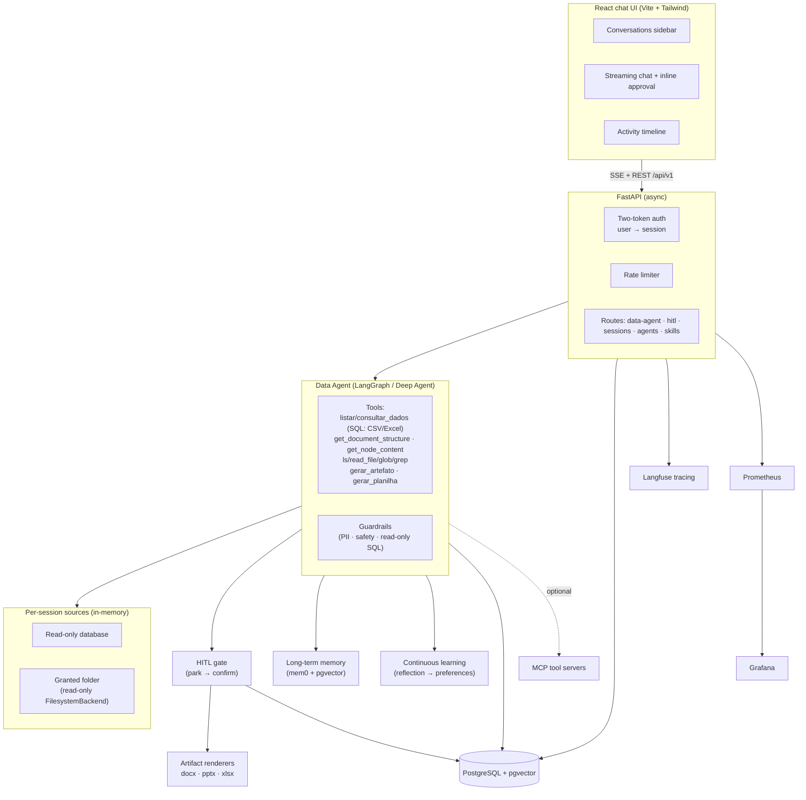
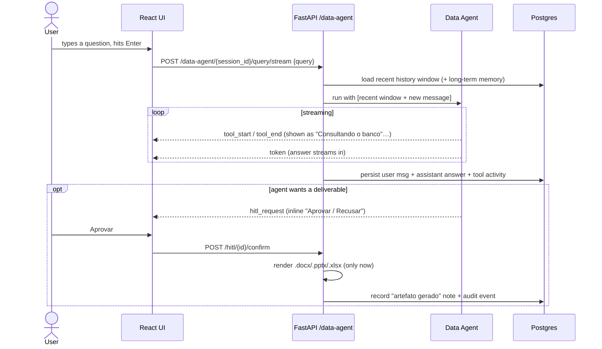
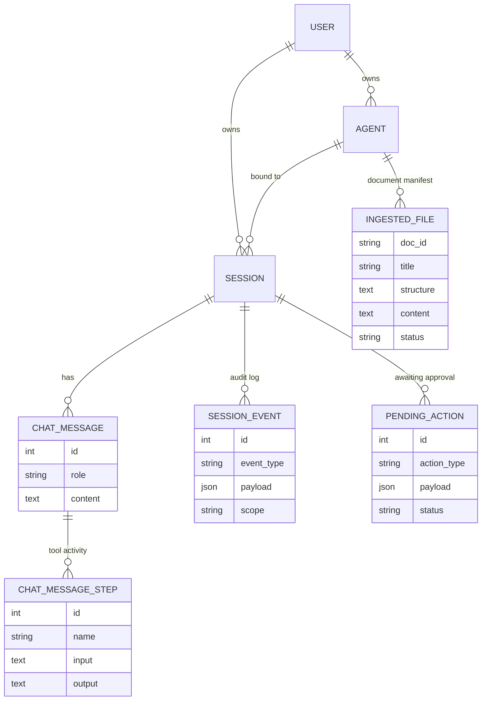

# Data Agent — talk to your data, get real deliverables

**Data Agent** is a production application (and the harness under it) for having a conversation with
your own data. Point it at a **read-only database** or a **folder of documents**, ask questions in
plain language, and watch the agent work: it runs SQL, reads files, and — when you approve — turns
the answer into a real **Word, PowerPoint, or Excel** file, with every claim traceable back to its
source.

It is built on a reusable **agent harness** that provides authentication, long-term memory,
conversation history, human-in-the-loop approval, observability, and evaluation out of the box. You
write agent logic; the harness runs it in production.

> Stack: **LangGraph / Deep Agents** · **FastAPI** (async, SSE) · **React 19 + Vite + Tailwind** ·
> **PostgreSQL + pgvector** · **mem0** (long-term memory) · **Langfuse** (tracing) ·
> **MCP** (tools) · **Prometheus + Grafana** (monitoring).

---

## What it does

| Capability | What you experience |
|---|---|
| 🔌 **Connect your data** | Attach a read-only database or grant a local folder. The agent gains SQL and file tools scoped to *that* session — nothing else is exposed. |
| 💬 **Chat with live activity** | Answers stream token-by-token. Behind the scenes the agent's tools show up in plain language — *"Consultando o banco", "Lendo arquivo", "Gerando planilha"*. |
| 🗂️ **Persistent history** | Every conversation is saved and reopenable from a sidebar. The active conversation's id lives in the URL (`/c/{session_id}`) for easy traceability. |
| 🕒 **Activity timeline** | A right-hand rail logs everything the agent did this session (queries, file reads, artifacts) — restored when you reopen a past conversation. |
| ✅ **Human-in-the-loop** | Anything that produces an outward deliverable is *parked for your approval* — it only runs after you say yes, right inside the chat. |
| 📄 **Real deliverables** | Approve and the agent renders a native **`.docx` / `.pptx` / `.xlsx`** — not a text blob, a valid Office file — with each claim marked with its source (or flagged `[SEM FONTE]`). |
| 🧠 **Memory + learning** | It remembers you across conversations (mem0) and *learns your preferences* (e.g. your favourite output format) from what you approve — no manual tuning. |
| 🔎 **Grounded answers (vectorless)** | Documents are indexed into a **structure tree** (PageIndex-style, built locally) — the agent navigates to the right section and reads exactly what it needs, with provenance. No embeddings, no chunking. Spreadsheets (CSV/Excel) are queried with exact SQL (DuckDB). |

---

## Architecture



**Design rule:** an agent is a self-contained directory under `src/app/agents/`. Everything else —
auth, memory, history, HITL, observability — is shared harness infrastructure the agent composes.

---

## How a turn works

The client sends **only the new message**. The server rebuilds recent context from persisted
history, streams the agent's work, and gates any deliverable on your approval.



Why this shape:

- **Small payloads, server-authoritative history.** The browser never resends the whole
  conversation; the backend owns it (see the data model below) and replays a bounded recent window
  so the agent stays coherent while older context comes from long-term memory.
- **Outward actions are gated.** Generating a file leaves the system, so it is *parked* and only
  executed on explicit confirmation — approval in one turn never carries to the next.

---

## Key capabilities in depth

### Connect your data (safely)
- **Database:** credentials are used to build an **in-memory, read-only** connection held per
  session — never persisted or logged. Only `SELECT`/`WITH`/`EXPLAIN`/`SHOW` run; writes are rejected.
- **Folder:** a granted path is exposed **read-only** through a per-session Deep Agents
  `FilesystemBackend` mounted at `/workspace`. Paths are validated against an allow-list on every use.

### Document intelligence (vectorless)
- At ingest each file is parsed into a **structure tree** (PageIndex-style, built locally with one
  cheap LLM refine call per PDF) plus its located text — both stored on the `IngestedFile` manifest.
  No embeddings, no chunk store, no vector DB.
- The agent **navigates** the tree (`get_document_structure` → `get_node_content`) to read exactly the
  relevant section, runs **literal term search** (`search_documents`), or reads **explicit pages**
  (`read_document`) — content is served from the manifest, not re-parsed from disk each time.
- **Spreadsheets & CSVs** become read-only SQL tables (DuckDB) so exact aggregations run in the engine
  (`consultar_dados`) — CSV, TSV, and each Excel sheet — never summed by hand.

### Conversation history & timeline
- Messages persist to a dedicated, append-only `chat_message` table (indexed by session, cursor
  paginated) — fast to render and independent of graph-state blobs.
- Each turn's tool activity persists to `chat_message_step`, so reopening a conversation restores
  both the chat *and* its "buscando / gerando / escrevendo" trail and the timeline.

### Human-in-the-loop deliverables
- The `gerar_artefato` / `gerar_planilha` tools don't write files — they **park** an
  `export_artifact` action. Approving runs the renderer; rejecting discards it. The approval is a
  compact, one-line prompt anchored to the turn that asked for it.

### Artifacts with provenance
- Content (`ArtifactSpec` / `SpreadsheetSpec`) is separated from presentation (`Template`), so the
  same content renders under any visual identity.
- Every claim carries its **source** or is explicitly marked `[SEM FONTE]` — traceability is
  enforced at render time, never silently dropped.

### Memory & continuous learning
- **Long-term memory (mem0 + pgvector):** relevant context is retrieved before each turn and updated
  in the background afterwards, per user and agent.
- **Reflection:** confirmed artifacts and audited events feed a reflection pass that derives learned
  preferences (e.g. `preferred_output_format`) injected back into the agent.
- **Corrections → skills:** user corrections propose skill refinements as drafts that require
  re-approval before they ever reach the agent.

---

## Data model (conversation core)



Tables are created by SQLModel's `create_all` at startup (and by LangGraph's checkpointer). The
root `schema.sql` is legacy — do not rely on it.

---

## The harness underneath

Everything the Data Agent leans on is reusable for any agent you build:

- **Two-token auth** — a *user token* (account: manage agents, skills, approvals) mints a
  *session token* (one conversation). JWT, per-endpoint rate limiting via slowapi.
- **Guardrails** — content filter, PII, and safety checks in the middleware pipeline.
- **Observability** — Langfuse tracing on every LLM call; Prometheus metrics (API latency, LLM
  duration, rate limits); pre-built Grafana dashboards; structured `structlog` logging (JSON in
  prod, colored console in dev) with request context bound automatically.
- **MCP** — external tool servers initialized at startup, multi-server, with graceful degradation to
  built-in tools if unavailable.
- **Evaluation** — metric-based scoring of outputs from Langfuse traces (relevancy, helpfulness,
  conciseness, hallucination, toxicity), defined as markdown prompt files.

**Reference agents** (for learning the harness): `chatbot` (simplest), `text_to_sql` (skills +
tools), `open_deep_research` (multi-subgraph). The **`data_agent`** is the flagship.

---

## Repository map

```
src/
├── app/
│   ├── main.py                # FastAPI app + lifespan (create_all, MCP, reaper)
│   ├── init.py                # repositories / services bootstrap
│   ├── agents/
│   │   ├── data_agent/        # ← the flagship: sources, tools, artifacts
│   │   ├── chatbot/ · text_to_sql/ · open_deep_research/   # reference agents
│   │   └── tools/             # shared tools
│   ├── api/v1/                # routes: data_agent, hitl, sessions, agents, skills, auth…
│   └── core/
│       ├── artifacts/         # ArtifactSpec + docx/pptx/xlsx renderers
│       ├── hitl/              # park → confirm gate + executors
│       ├── memory/ · learning/# mem0 memory + reflection/corrections
│       ├── session/           # session, chat_message(+step), event models & repos
│       ├── ingestion/         # parse folder → manifest (structure tree + located text)
│       ├── structure/         # per-file document structure tree (PageIndex-style, local)
│       ├── sandbox/           # per-session DB + FilesystemBackend registry
│       └── guardrails/ · llm/ · mcp/ · metrics/ · middleware/
├── cli/                       # terminal clients per agent
└── evals/                     # evaluation framework
frontend/                      # React chat UI (see frontend/README.md)
```

---

## Quick start

**Prerequisites:** Python 3.13+, Docker (for Postgres/pgvector), Node 20+ (for the frontend).

```bash
# 1. Install
uv sync

# 2. Configure — fill OPENAI_API_KEY, JWT_SECRET_KEY, LANGFUSE_* (optional)
cp .env.example .env.development

# 3. Start Postgres (pgvector) then the API
make db-up
make dev                      # http://localhost:8000  ·  Swagger at /docs
```

Tables (including `chat_message` and `chat_message_step`) are created automatically on startup.

**Windows:** `make`/`bash` are Linux/Mac. Use `.\dev.ps1` — it starts Postgres, forces the
SelectorEventLoop (psycopg's async pool can't use the ProactorEventLoop), and runs the API.

**Frontend:**
```bash
cd frontend && npm install && npm run dev      # http://localhost:5173 (proxies /api → :8000)
```

**Full stack (API + Postgres + Prometheus + Grafana + cAdvisor):**
```bash
make docker-compose-up ENV=development
# Grafana http://localhost:3000 (admin/admin) · Prometheus http://localhost:9090
```

**Tests:** `uv run pytest tests/` · **Lint/format:** `make lint` / `make format`

---

## Configuration

Config lives in `.env.<environment>` and is read in `src/app/core/common/config.py` (the single
source of truth). Key variables:

| Category | Variable | Default |
|---|---|---|
| App | `APP_ENV` | `development` |
| LLM | `LLM_PROVIDER` · `ANTHROPIC_API_KEY` · `OPENAI_API_KEY` | `anthropic` (Claude Sonnet 5) · — · — |
| Memory | `LONG_TERM_MEMORY_MODEL` · `LONG_TERM_MEMORY_EMBEDDER_MODEL` | `gpt-5-nano` · `text-embedding-3-small` |
| Sources | `SANDBOX_ENABLED` · `SANDBOX_ALLOWED_ROOTS` · `SESSION_SOURCE_TTL` | `true` · — · `3600` |
| Auth | `JWT_SECRET_KEY` · `JWT_ACCESS_TOKEN_EXPIRE_DAYS` | — · `30` |
| Database | `POSTGRES_HOST` · `POSTGRES_PORT` · `POSTGRES_DB` | `localhost` · `5432` · — |
| Observability | `LANGFUSE_PUBLIC_KEY` · `LANGFUSE_SECRET_KEY` · `LANGFUSE_HOST` | — · — · `cloud.langfuse.com` |
| MCP | `MCP_ENABLED` · `MCP_HOSTNAMES_CSV` | `true` · — |

See `.env.example` for the complete list.

---

## API reference (essentials)

**Data Agent** (`/api/v1/data-agent`) — session-scoped for traceability:

| Method | Endpoint | Description |
|---|---|---|
| POST | `/connect-db` | Attach a read-only database to the session |
| POST | `/grant-folder` | Grant read-only access to a folder |
| POST | `/{session_id}/query/stream` | Ask a question — SSE stream of tools + tokens |
| GET | `/{session_id}/messages` | Persisted conversation + per-turn activity |
| GET | `/{session_id}/artifacts/{action_id}/download` | Download a confirmed artifact |
| GET | `/status` · POST `/disconnect` | Source status / detach sources |

**Human-in-the-loop** (`/api/v1/hitl`): `GET /pending`, `POST /{id}/confirm`, `POST /{id}/reject`.
**Sessions** (`/api/v1/sessions`): `GET /{session_id}/events` (audit log).
**Auth** (`/api/v1/auth`): `register`, `login`, `session`, `sessions`, `session/{id}/name`,
`session/{id}` (delete cascades a conversation's messages, activity, events, and generated files).
**Agents / Skills** (`/api/v1/agents`, `/api/v1/skills`): CRUD, folder/DB binding, corrections,
skill versions.

Full, live docs at `/docs` (Swagger) and `/redoc`.

---

## Build your own agent

The harness is not Data-Agent-specific. A new agent is a directory under `src/app/agents/<name>/`
with `__init__.py` (a `load_system_prompt()` helper), `agent_<name>.py` (compiles a LangGraph
graph), `system.md` (prompt; supports `{long_term_memory}` and `{current_date_and_time}`), and an
optional `tools/`. Add a DTO + route under `src/app/api/v1/`, register it in `api.py`, and add a
rate-limit entry in `config.py`. Use `src/app/agents/chatbot/` as the canonical reference, or the
`/new-agent` scaffold.

Non-negotiable conventions (enforced): every route is rate-limited, every LLM call is Langfuse-traced,
all DB/IO is async, logging is structured `structlog` (no f-strings), retries use `tenacity`, and
imports live at the top of the file. See `CLAUDE.md`.

---

## License

Licensed under the terms in the [LICENSE](LICENSE) file. Contributions welcome — follow the coding
standards in `CLAUDE.md`, keep tests green, and cover new behavior with tests.
