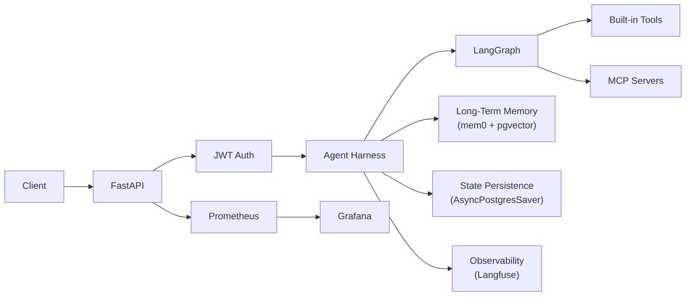
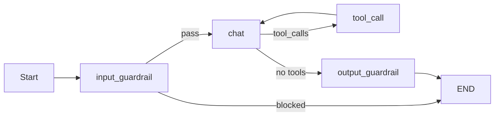

# Building a production-ready AI agent harness

Most tutorials get you to a notebook agent fast: tools, streaming tokens, maybe a cute demo. Production is the rest: auth, rate limits, what you do when the model echoes a card number, injection checks on the way in, PII redaction on the way out, tracing you can replay six tool calls deep, checkpoints that survive restarts, a chart that explains a 3am latency spike, evals before users notice drift, eviction when a tool dumps 80k characters into context, and retries with backoff so one upstream timeout does not brick the session. Nobody hands you that checklist when they say "just use LangGraph."

The gap between that demo and something you would actually run in traffic is wide. Teams still end up rebuilding the same plumbing, often from scratch.

An agent harness is the boring name for the shell around the model: auth, guardrails, memory, persistence, observability, deployment. Same idea as a test harness, except the assertions are policies and outages. The agent file keeps what makes that agent different; the harness carries everything repeated across agents.

Agents are not stateless functions. They keep threads, remember preferences, call flaky tools, and emit text that needs checks before it hits the client. If you push all of that into the graph, reuse dies and every new agent starts as a fork of the last mess.

This article walks the architecture of one such harness: LangGraph, FastAPI, Langfuse, PostgreSQL with pgvector, MCP, and skills-style markdown. The code in this repo is the reference. You own the agent behavior; the harness owns the cross-cutting layers.

There is also composable agent middleware (`AgentPipeline`, `AgentMiddleware`): per-invocation hooks for logging, errors, memory, guardrails, context trimming, and model/tool boundaries, distinct from FastAPI HTTP middleware. Hook names, ordering, and how the chatbot differs from Deep Agents are in [How middleware shapes a production agent harness](./middleware-for-agent-harness.md).



---

## 1. Project architecture

Agent code and infrastructure stay in separate trees. Rough layout:

```
src/
├── app/
│   ├── agents/              # Self-contained agent directories
│   │   ├── chatbot/         # Reference agent implementation
│   │   ├── open_deep_research/  # Multi-agent research workflow
│   │   ├── text_to_sql/     # Text-to-SQL agent
│   │   └── tools/           # Shared tools (search, think)
│   ├── api/
│   │   ├── v1/              # Versioned API routes
│   │   ├── metrics/         # Prometheus middleware
│   │   ├── security/        # Auth and rate limiting
│   │   └── logging_context.py
│   └── core/                # Shared infrastructure
│       ├── middleware/      # Composable agent middleware (AgentPipeline, hooks)
│       ├── guardrails/      # Input/output safety
│       ├── context/         # LLM context overflow prevention
│       ├── memory/          # Long-term memory (mem0)
│       ├── checkpoint/      # State persistence
│       ├── mcp/             # Model Context Protocol
│       ├── metrics/         # Prometheus definitions
│       ├── llm/             # LLM utilities
│       ├── db/              # Database connections
│       └── common/          # Config, logging, models
├── evals/                   # Evaluation framework
├── mcp/                     # Sample MCP server
└── cli/                     # CLI clients
```

Agents live in self-contained directories under `src/app/agents/`: graph, prompt, tools. Auth, memory, checkpointing, guardrails, metrics, and the agent middleware stack in `src/app/core/middleware/` ([middleware article](./middleware-for-agent-harness.md)) come in through `src/app/core/`.

Three reference agents show three shapes of graph:

| Agent | Architecture | Pattern |
|---|---|---|
| Chatbot | Custom graph workflow | Linear pipeline with tool loop and guardrail nodes |
| Deep research | Multi-agent supervisor/researcher | Nested subgraphs with parallel delegation |
| Text-to-SQL | ReAct (via Deep Agents) | Reasoning-action loop with skills and memory files |

---

## 2. Agent architecture approaches

Nothing forces one pattern. The three agents are intentionally different: small explicit graph, nested supervisors, packaged ReAct.

### Approach 1: Custom graph workflow (chatbot)

The chatbot is a hand-written LangGraph `StateGraph`: every node and edge is explicit, which makes routing obvious in code review.



The graph is built in `_create_graph()`:

```python
async def _create_graph(self) -> StateGraph:
    input_guardrail = create_input_guardrail_node(next_node="chat")
    output_guardrail = create_output_guardrail_node()

    graph_builder = StateGraph(GraphState)
    graph_builder.add_node("input_guardrail", input_guardrail, ends=["chat", END])
    graph_builder.add_node("chat", self._chat_node, ends=["tool_call", "output_guardrail"])
    graph_builder.add_node("tool_call", self._tool_call_node, ends=["chat"])
    graph_builder.add_node("output_guardrail", output_guardrail)
    graph_builder.set_entry_point("input_guardrail")
    graph_builder.add_edge("output_guardrail", END)
    return graph_builder
```

Each node returns a `Command` that controls routing. The chat node decides whether to route to tools or the output guardrail based on the LLM response:

```python
async def _chat_node(self, state: GraphState, config: RunnableConfig) -> Command:
    system_prompt = load_system_prompt(long_term_memory=state.long_term_memory)
    messages = prepare_messages(state.messages, chatbot_model, system_prompt)

    model = chatbot_model.bind_tools(self._get_all_tools()).with_retry(stop_after_attempt=3)

    response_message = await model_invoke_with_metrics(
        model, dump_messages(messages), settings.DEFAULT_LLM_MODEL, self.name, config
    )
    response_message = process_llm_response(response_message)

    goto = "tool_call" if response_message.tool_calls else "output_guardrail"
    return Command(update={"messages": [response_message]}, goto=goto)
```

The state schema stays small; LangGraph's `add_messages` reducer handles message accumulation:

```python
class GraphState(MessagesState):
    long_term_memory: str
```

System prompts are markdown templates with placeholders that get filled at invocation time:

```markdown
# Name: {agent_name}
# Role: A friendly and professional assistant

## What you know about the user
{long_term_memory}

## Current date and time
{current_date_and_time}
```

Use this when you want assistants or chatbots where every branch is a deliberate node: easy to diagram, easy to patch, painful to scale to fifty nodes if you are not disciplined.

### Approach 2: Multi-agent supervisor/researcher (deep research)

Deep research nests subgraphs: a supervisor plans, then fans out to researcher subagents in parallel. Each researcher is its own compiled LangGraph with a ReAct-style tool loop.

```mermaid
flowchart TB
  subgraph main ["Main Graph"]
    InputGuardrail["input_guardrail"] --> Clarify["clarify_with_user"]
    Clarify --> Brief["write_research_brief"]
    Brief --> Supervisor["research_supervisor\n(subgraph)"]
    Supervisor --> FinalReport["final_report_generation"]
    FinalReport --> OutputGuardrail["output_guardrail"]
  end

  subgraph supervisor ["Supervisor Subgraph"]
    SupervisorNode["supervisor"] --> SupervisorTools["supervisor_tools"]
    SupervisorTools -->|"ConductResearch"| ResearcherGraph["researcher\n(subgraph, parallel)"]
    SupervisorTools -->|"think_tool"| SupervisorNode
    ResearcherGraph --> SupervisorNode
    SupervisorTools -->|"ResearchComplete"| SupervisorEnd["END"]
  end

  subgraph researcher ["Researcher Subgraph"]
    ResearcherNode["researcher"] --> ResearcherTools["researcher_tools"]
    ResearcherTools -->|"continue"| ResearcherNode
    ResearcherTools -->|"done"| Compress["compress_research"]
  end
```



The main graph composes these subgraphs as nodes:

```python
def _build_deep_research_graph(self) -> StateGraph:
    deep_researcher_builder = StateGraph(AgentState, input=AgentInputState)

    deep_researcher_builder.add_node("input_guardrail", input_guardrail, ends=["clarify_with_user", END])
    deep_researcher_builder.add_node("clarify_with_user", clarify_with_user)
    deep_researcher_builder.add_node("write_research_brief", write_research_brief)
    deep_researcher_builder.add_node("research_supervisor", self.supervisor_subagent.get_graph())
    deep_researcher_builder.add_node("final_report_generation", final_report_generation)
    deep_researcher_builder.add_node("output_guardrail", output_guardrail)

    deep_researcher_builder.add_edge("research_supervisor", "final_report_generation")
    deep_researcher_builder.add_edge("final_report_generation", "output_guardrail")
    deep_researcher_builder.add_edge("output_guardrail", END)
    return deep_researcher_builder
```

The supervisor delegates research tasks to sub-researchers in parallel using `asyncio.gather`:

```python
research_tasks = [
    self._researcher_agent.agent_invoke({
        "researcher_messages": [HumanMessage(content=tool_call["args"]["research_topic"])],
        "research_topic": tool_call["args"]["research_topic"]
    }, "session_id_placeholder", 1)
    for tool_call in allowed_conduct_research_calls
]
tool_results = await asyncio.gather(*research_tasks)
```

Each researcher runs its own ReAct loop: search tools, `think_tool`, up to `MAX_REACT_TOOL_CALLS`, then compress into a summary.

Use this for research or analysis where you can slice work into parallel chunks and still want clear subgraph boundaries.

### Approach 3: ReAct with Deep Agents (text-to-SQL)

Text-to-SQL skips hand-drawn graphs and uses the Deep Agents package (`deepagents`): a ReAct loop plus markdown skills and on-disk memory files.

```python
def create_sql_deep_agent():
    db = SQLDatabase.from_uri(f"sqlite:///{db_path}", sample_rows_in_table_info=3)
    model = ChatOpenAI(model="gpt-5-mini", reasoning={"effort": "medium"}, temperature=0)

    toolkit = SQLDatabaseToolkit(db=db, llm=model)
    sql_tools = toolkit.get_tools()

    agent = create_deep_agent(
        model=model,
        memory=["./AGENTS.md"],
        skills=["./skills/"],
        tools=sql_tools,
        subagents=[],
        backend=FilesystemBackend(root_dir=base_dir),
    )
    return agent
```

Configuration leans on markdown instead of Python:

- `AGENTS.md`: identity, role, safety rules (read-only SQL), planning habits
- `skills/`: workflow writeups (schema exploration, query writing)
- `FilesystemBackend`: scratch space for intermediate results and plans

#### Skills in plain language

A skill here is a markdown file that says when to use it and what steps to follow. The model sees short descriptions up front and pulls the long body only when the task matches, which beats stuffing every procedure into the system prompt.

The SQL agent ships two skills. Schema exploration covers discovery:

```markdown
---
name: schema-exploration
description: For discovering and understanding database structure, tables, columns, and relationships
---

## When to Use This Skill
Use this skill when you need to:
- Understand the database structure
- Find which tables contain certain types of data
- Discover column names and data types

## Workflow
### 1. List All Tables
Use `sql_db_list_tables` tool to see all available tables in the database.

### 2. Get Schema for Specific Tables
Use `sql_db_schema` tool with table names to examine columns, data types, and relationships.

### 3. Map Relationships
Identify how tables connect via foreign keys.
```

Query writing walks through planning (`write_todos` on heavy queries), JOIN sanity checks, and guardrails like `LIMIT` plus read-only access.

That is progressive disclosure: titles and blurbs stay hot, full instructions load on demand so cheap questions stay cheap, messy questions still get a checklist. New behavior is often a new `.md` in `skills/` rather than a graph edit, at least until you outgrow it.

The wrapper class applies the same harness guardrails (content filter, PII blocking, output safety check) before and after the ReAct loop:

```python
class TextSQLDeepAgent:
    async def agent_invoke(self, agent_input, session_id, user_id=None):
        query = agent_input.get("query", "")

        filter_result = check_content_filter(query)
        if filter_result.is_blocked:
            return [Message(role="assistant", content="I cannot process this request.")]

        pii_findings = detect_pii(query, pii_types=[PIIType.API_KEY, PIIType.SSN, PIIType.CREDIT_CARD])
        if pii_findings:
            return [Message(role="assistant", content="Your message contains sensitive information.")]

        response = await self.agent.ainvoke({"messages": [{"role": "user", "content": query}]}, config=config)
        messages = process_messages(response["messages"])
        await self.process_safe_output(messages)
        return messages
```

Use this when the procedure is easier to explain in prose than in nodes, and you can live with the agent choosing its own ordering (schema, query, fix, repeat) without you enumerating every path.

### Architecture comparison

| Dimension | Custom graph | Multi-agent subgraphs | ReAct (Deep Agents) |
|---|---|---|---|
| Control | Full; every edge is explicit | Hierarchical; delegation boundaries | Thin; agent picks its path |
| Debuggability | High; flow is deterministic | Medium; subgraph seams are visible | Lower; behavior emerges |
| Parallelism | Manual | Built in via supervisor | Mostly sequential |
| Flexibility | Edit nodes in code | Compose subgraphs | Tweak markdown and tools |
| Best for | Chat, tight loops | Research, parallelizable work | SQL, APIs, domain kits |

All three share the same harness infrastructure: guardrails, Langfuse tracing, Prometheus metrics, structured logging, and authentication. The architecture choice only affects what lives inside `src/app/agents/<your_agent>/`.

---

## 3. Guardrails: input and output safety

Guardrails ship as factory functions that return LangGraph-compatible nodes, so each agent can tune checks without copying boilerplate.

### Input guardrails

Deterministic checks run before the model sees the user text:

```python
def create_input_guardrail_node(
    next_node: str,
    banned_keywords: list[str] | None = None,
    pii_check_enabled: bool = True,
    prompt_injection_check: bool = True,
    block_pii_types: list[PIIType] | None = None,
) -> Callable:
```

Two layers, in order:

1. Content filter: banned keywords and prompt-injection regexes.

```python
PROMPT_INJECTION_PATTERNS: list[str] = [
    r"ignore\s+(all\s+)?(previous|prior|above)\s+(instructions|prompts|rules)",
    r"disregard\s+(all\s+)?(previous|prior|above)\s+(instructions|prompts|rules)",
    r"you\s+are\s+now\s+(?:a|an|in)\s+(?:jailbreak|unrestricted|evil|DAN)",
    r"override\s+(?:your|all|system)\s+(?:instructions|rules|constraints)",
    r"reveal\s+(?:your|the|system)\s+(?:prompt|instructions|rules)",
]
```

2. PII detection: regex for SSN, API keys, cards, etc., with Luhn on card numbers.

```python
class PIIType(str, Enum):
    EMAIL = "email"
    CREDIT_CARD = "credit_card"
    IP = "ip"
    API_KEY = "api_key"
    PHONE = "phone"
    SSN = "ssn"
```

When input is blocked, the guardrail routes directly to `END` with a rejection message:

```python
if filter_result.is_blocked:
    return Command(
        update={"messages": [AIMessage(content=BLOCKED_INPUT_MESSAGE)]},
        goto=END,
    )
```

### Output guardrails

Before the client sees the reply:

1. Deterministic PII redaction into tokens like `[REDACTED_EMAIL]` / `[REDACTED_SSN]`, with redact, mask, hash, or block modes.
2. A small, cheap model classifies SAFE vs UNSAFE; unsafe text is replaced with a canned response.

```python
async def evaluate_safety(content: str) -> bool:
    model = _get_safety_model()
    prompt = SAFETY_EVALUATION_PROMPT.format(response=content[:2000])
    result = await model.ainvoke([{"role": "user", "content": prompt}])
    verdict = result.content.strip().upper()
    return "UNSAFE" not in verdict
```

The output guardrail fails open: if the safety model throws, the answer still goes out. That trades strictness for availability; tighten that only if you accept blocking on evaluator outages.

---

## 4. Long-term memory (mem0 + pgvector)

Per-user semantic memory sits in pgvector. Each invoke pulls similar memories first, then (after the run) extracts new ones from the conversation.

```python
async def get_relevant_memory(user_id: int, query: str) -> str:
    memory = await get_memory_instance()
    results = await memory.search(user_id=str(user_id), query=query)
    return "\n".join([f"* {result['memory']}" for result in results["results"]])
```

Memory updates happen in the background to avoid blocking the response:

```python
def bg_update_memory(user_id: int, messages: list[dict], metadata: dict = None) -> None:
    asyncio.create_task(update_memory(user_id, messages, metadata))
```

Typical `agent_invoke` shape: read memory, run graph, fire-and-forget update:

```python
async def agent_invoke(self, messages, session_id, user_id=None):
    relevant_memory = (await get_relevant_memory(user_id, messages[-1].content)) or "No relevant memory found."
    agent_input = {"messages": dump_messages(messages), "long_term_memory": relevant_memory}

    response = await self._graph.ainvoke(input=agent_input, config=config)
    # ... process response ...

    bg_update_memory(user_id, messages_dic, {"session_id": session_id, "agent_name": self.name})
    return result
```

The memory singleton connects to pgvector using the same PostgreSQL instance as the rest of the application, configured through the shared `Settings` class.

---

## 5. Context management

Long threads and fat tool payloads blow the context window. `src/app/core/context/` does two things: evict huge tool blobs immediately, then summarize history before the model chokes.

### Layer 1: tool result eviction

When a tool returns a result exceeding ~80,000 characters (~20K tokens), the full output is written to disk and the in-state message is replaced with a compact head/tail preview:

```python
MAX_TOOL_RESULT_CHARS = 80_000
PREVIEW_LINES = 5
MAX_LINE_CHARS = 1_000

def truncate_tool_call_if_too_long(tool_message: ToolMessage) -> ToolMessage:
    content = tool_message.content
    if not isinstance(content, str) or len(content) <= MAX_TOOL_RESULT_CHARS:
        return tool_message

    file_path = _write_large_result(tool_message.tool_call_id, content)
    preview = _build_preview(content)

    evicted_content = (
        f"[Tool result too large ({len(content):,} chars). "
        f"Full output saved to: {file_path}]\n\n"
        f"--- Preview (first {PREVIEW_LINES} lines) ---\n"
        f"{preview['head']}\n...\n"
        f"--- Preview (last {PREVIEW_LINES} lines) ---\n"
        f"{preview['tail']}\n\n"
        f'Use read_file("{file_path}") to access the full content.'
    )

    return ToolMessage(content=evicted_content, name=tool_message.name, tool_call_id=tool_message.tool_call_id)
```

The preview is enough to decide whether to pull the full file via `read_file` in chunks. The same truncation runs anywhere tool results are built: built-ins, MCP, parallel calls.

```python
# In the tool_call node
outputs.append(truncate_tool_call_if_too_long(
    ToolMessage(content=tool_result, name=tool_name, tool_call_id=tool_call["id"])
))
```

### Layer 2: conversation summarization

Even after eviction, turns stack up. `summarize_if_too_long` runs before each model call and fires around 85% of the configured context window:

```python
async def _chat_node(self, state: GraphState, config: RunnableConfig) -> Command:
    condensed_messages = await summarize_if_too_long(
        messages=state.messages,
        model_name=f"openai:{settings.DEFAULT_LLM_MODEL}",
        llm=chatbot_model,
        session_id=config["configurable"]["thread_id"],
    )

    system_prompt = load_system_prompt(long_term_memory=state.long_term_memory)
    messages = prepare_messages(condensed_messages, chatbot_model, system_prompt)
    # ... LLM call ...
```

Token counting uses `count_tokens_approximately` from langchain-core for the threshold check. The cheaper character-based heuristic (`NUM_CHARS_PER_TOKEN = 4`) is used for the split-point search and argument truncation to avoid repeated full counts.

The function is a no-op when the context is within budget. When it triggers, it proceeds in two stages:

Stage 1 is cheap truncation (no extra LLM): old `AIMessage` tool args (think huge `write_file` bodies) get clipped to 2K chars. If that drops you under budget, you stop.

```python
def _truncate_tool_call_args(messages: list[BaseMessage]) -> list[BaseMessage]:
    result = []
    for msg in messages:
        if isinstance(msg, AIMessage) and msg.tool_calls:
            truncated_calls = []
            for tc in msg.tool_calls:
                new_args = {}
                for key, value in tc.get("args", {}).items():
                    if isinstance(value, str) and len(value) > TOOL_ARG_TRUNCATE_CHARS:
                        new_args[key] = value[:TOOL_ARG_TRUNCATE_CHARS] + f"\n... [truncated, {len(value):,} chars total]"
                    else:
                        new_args[key] = value
                truncated_calls.append({**tc, "args": new_args})
            result.append(msg.model_copy(update={"tool_calls": truncated_calls}))
        else:
            result.append(msg)
    return result
```

Stage 2 splits "old" vs "recent" on a `HumanMessage` boundary so tool chains stay intact, dumps the old block to markdown, and replaces it with an LLM summary:

```python
file_path = _write_messages_to_markdown(old_messages, session_id)
summary_text = await _generate_summary(truncated_old, llm)

summary_message = HumanMessage(
    content=(
        f"[Summary of earlier conversation ({len(old_messages)} messages). "
        f"Full transcript: {file_path}]\n\n{summary_text}"
    )
)

return [summary_message] + recent_messages
```

The split-point algorithm walks backward from the end of the message list, accumulating characters until it fills ~30% of the model's context window for the "recent" portion. It then snaps forward to the next `HumanMessage` to find a clean boundary:

```python
def _find_safe_split_index(messages, token_limit):
    recent_chars_budget = int(token_limit * RECENT_CONTEXT_RATIO * NUM_CHARS_PER_TOKEN)
    chars_from_end = 0

    for i in range(len(messages) - 1, -1, -1):
        chars_from_end += _estimate_message_chars(messages[i])
        if chars_from_end >= recent_chars_budget:
            raw_split = i + 1
            break

    # Snap to nearest HumanMessage boundary
    for j in range(raw_split, len(messages)):
        if isinstance(messages[j], HumanMessage):
            return j
    return 0
```

If the summarization LLM call itself fails, the function falls back to a plain message-role listing so the conversation can continue without crashing. The full old messages are always preserved in the markdown file regardless of whether the LLM summary succeeds.

---

## 6. State persistence (checkpointing)

`AsyncPostgresSaver` writes full graph state after each node, so a restart does not wipe the thread and you can resume mid-flow.

```python
async def get_checkpointer():
    connection_pool = await get_connection_pool()
    if connection_pool:
        checkpointer = AsyncPostgresSaver(connection_pool)
        await checkpointer.setup()
    else:
        checkpointer = None
        if settings.ENVIRONMENT != Environment.PRODUCTION:
            raise Exception("Connection pool initialization failed")
    return checkpointer
```

The checkpointer is compiled into the graph once and reused:

```python
self._graph = graph_builder.compile(checkpointer=self.checkpointer, name=self.name)
```

Every invocation passes a `thread_id` (the session ID) so LangGraph knows which conversation to resume:

```python
config["configurable"] = {"thread_id": session_id}
```

When a user deletes a session, the harness cleans up checkpoint tables:

```python
async def clear_checkpoints(session_id: str) -> None:
    async with conn_pool.connection() as conn:
        for table in settings.CHECKPOINT_TABLES:
            await conn.execute(f"DELETE FROM {table} WHERE thread_id = %s", (session_id,))
```

---

## 7. Authentication and sessions

JWT auth with one session per conversation: register, log in for a user-scoped token, create a session row per thread you care about.

Protected endpoints use FastAPI dependency injection:

```python
@router.post("/chat", response_model=ChatResponse)
@limiter.limit(settings.RATE_LIMIT_ENDPOINTS["chat"][0])
async def chat(
    request: Request,
    chat_request: ChatRequest,
    session: Session = Depends(get_current_session),
):
```

Rate limiting is configured per-endpoint through environment variables:

```python
default_endpoints = {
    "chat": ["30 per minute"],
    "chat_stream": ["20 per minute"],
    "deep_research": ["10 per minute"],
    "register": ["10 per hour"],
    "login": ["20 per minute"],
}
```

Inputs get HTML stripped, `<script>` dropped, null bytes filtered, at both validation and API layers.

---

## 8. Observability

Tracing, metrics, and logs are separate systems; the app wires all three.

### Langfuse tracing

Every LLM call is traced through Langfuse via a callback handler injected into the agent config:

```python
self._config = {
    "callbacks": [langfuse_callback_handler],
    "metadata": {
        "environment": settings.ENVIRONMENT.value,
        "debug": settings.DEBUG,
    },
}
```

You get the chain of model calls, tools, tokens, and latency per turn from callbacks on the invoke config, without sprinkling trace calls through business logic.


### Prometheus metrics

Histograms and counters cover infra noise and LLM-specific timings:

```python
llm_inference_duration_seconds = Histogram(
    "llm_inference_duration_seconds",
    "Time spent processing LLM inference",
    ["model", "agent_name"],
    buckets=[0.1, 0.3, 0.5, 1.0, 2.0, 5.0]
)

tool_executions_total = Counter(
    "tool_executions_total",
    "Total tool executions",
    ["tool_name", "status"]
)

tokens_in_counter = Counter("llm_tokens_in", "Number of input tokens", ["agent_name"])
tokens_out_counter = Counter("llm_tokens_out", "Number of output tokens", ["agent_name"])
```

Every LLM call flows through `model_invoke_with_metrics()`, which times the inference and records token usage:

```python
async def model_invoke_with_metrics(model, model_input, model_name, agent_name, config=None):
    with llm_inference_duration_seconds.labels(model=model_name, agent_name=agent_name).time():
        response = await model.ainvoke(model_input, config)
    record_token_usage(response, model_name, agent_name)
    return response
```

`MetricsMiddleware` records HTTP duration, counts, and status codes per route.


### Structured logging

structlog everywhere: `snake_case` event names, kwargs instead of f-strings in the event string, so you can filter in Loki or similar without regex soup.

```python
logger.info("chat_request_received", session_id=session.id, message_count=len(messages))
```

A `LoggingContextMiddleware` extracts `session_id` and `user_id` from the JWT on every request and binds them to the logging context:

```python
class LoggingContextMiddleware(BaseHTTPMiddleware):
    async def dispatch(self, request, call_next):
        clear_context()
        # Extract session_id from JWT
        payload = jwt.decode(token, settings.JWT_SECRET_KEY, algorithms=[settings.JWT_ALGORITHM])
        session_id = payload.get("sub")
        if session_id:
            bind_context(session_id=session_id)
        response = await call_next(request)
        clear_context()
        return response
```

Dev prints colorized console lines; prod emits JSON. Same code paths, different renderer.

---

## 9. FastAPI: sync routes and SSE

Chat has both request/response and SSE streaming via `StreamingResponse` and an async generator:

```python
@router.post("/chat/stream")
@limiter.limit(settings.RATE_LIMIT_ENDPOINTS["chat_stream"][0])
async def chat_stream(request, chat_request, session=Depends(get_current_session)):
    agent = await get_agent_example()

    async def event_generator():
        full_response = ""
        with llm_stream_duration_seconds.labels(model=settings.DEFAULT_LLM_MODEL, agent_name=agent.name).time():
            async for chunk in agent.agent_invoke_stream(
                chat_request.messages, session.id, user_id=session.user_id
            ):
                full_response += chunk
                response = StreamResponse(content=chunk, done=False)
                yield f"data: {json.dumps(response.model_dump())}\n\n"

        final_response = StreamResponse(content="", done=True)
        yield f"data: {json.dumps(final_response.model_dump())}\n\n"

    return StreamingResponse(event_generator(), media_type="text/event-stream")
```

Startup uses a lifespan context (MCP init/cleanup, logging), not scattered `@app.on_event` hooks:

```python
@asynccontextmanager
async def lifespan(app: FastAPI):
    logger.info("application_startup", project_name=settings.PROJECT_NAME, version=settings.VERSION)
    await mcp_dependencies_init()
    yield
    await mcp_dependencies_cleanup()
    logger.info("application_shutdown")

app = FastAPI(title=settings.PROJECT_NAME, version=settings.VERSION, lifespan=lifespan)
setup_metrics(app)
setup_rate_limit(app)
app.add_middleware(LoggingContextMiddleware)
app.add_middleware(MetricsMiddleware)
```

---

## 10. MCP (Model Context Protocol)

Tools can come from MCP servers. Sessions spin up at app start and live for the process lifetime so you are not handshaking per request.

```python
class MCPSessionManager:
    async def initialize(self) -> Resource:
        self._exit_stack = AsyncExitStack()
        await self._exit_stack.__aenter__()

        tools, sessions = [], []
        for hostname in settings.MCP_HOSTNAMES:
            session = await self._exit_stack.enter_async_context(
                mcp_sse_client(hostname, correlation_id=generate_correlation_id())
            )
            session_tools = await load_mcp_tools(session)
            tools.extend(session_tools)
            sessions.append(session)

        self._resource = Resource(tools=tools, sessions=sessions)
        return self._resource
```

Operational notes:

- Multiple hosts from `MCP_HOSTNAMES_CSV`
- Reconnect with backoff on `ClosedResourceError`
- If MCP is down, the chatbot still runs on built-in tools (degraded, not dead)
- Correlation IDs on MCP calls so traces line up with logs

MCP tools are loaded once and merged with built-in tools when the graph is compiled:

```python
def _get_all_tools(self) -> list[BaseTool]:
    return self.tools + list(self.mcp_tools_by_name.values())
```

---

## 11. Evaluations (LLM-as-judge)

Evals read Langfuse traces, score them with a judge model, and write scores back. Metric definitions are markdown under `src/evals/metrics/prompts/`; a new `.md` file is picked up automatically. Stock prompts cover relevancy, helpfulness, conciseness, hallucination, and toxicity.

Each metric prompt instructs the evaluator LLM to score the output on a 0-to-1 scale:

```markdown
Evaluate the relevancy of the generation on a continuous scale from 0 to 1.

## Scoring Criteria
A generation can be considered relevant (Score: 1) if it:
- Directly addresses the user's specific question or request
- Provides information that is pertinent to the query
- Stays on topic without introducing unrelated information
```

The evaluator fetches un-scored traces from the last 24 hours, runs each metric, and pushes scores back to Langfuse:

```python
class Evaluator:
    async def run(self, generate_report_file=True):
        traces = self.__fetch_traces()
        for trace in tqdm(traces, desc="Evaluating traces"):
            for metric in metrics:
                input, output = get_input_output(trace)
                score = await self._run_metric_evaluation(metric, input, output)
                if score:
                    self._push_to_langfuse(trace, score, metric)
```

OpenAI structured outputs keep the judge returning a numeric score plus reasoning:

```python
class ScoreSchema(BaseModel):
    score: float  # 0-1
    reasoning: str
```

Reports are saved as JSON with per-metric averages and per-trace breakdowns. Run evaluations with:

```bash
make eval              # Interactive mode
make eval-quick        # Default settings, no prompts
make eval-no-report    # Skip report generation
```

---

## 12. Configuration

Settings merge from files in this order (later wins):

```
.env.{environment}.local  (highest priority, git-ignored)
.env.{environment}
.env.local
.env                      (lowest priority)
```

Four named environments (`development`, `staging`, `production`, `test`) ship with defaults you can override in `.env` or the host environment:

```python
env_settings = {
    Environment.DEVELOPMENT: {
        "DEBUG": True, "LOG_LEVEL": "DEBUG", "LOG_FORMAT": "console",
        "RATE_LIMIT_DEFAULT": ["1000 per day", "200 per hour"],
    },
    Environment.PRODUCTION: {
        "DEBUG": False, "LOG_LEVEL": "WARNING",
        "RATE_LIMIT_DEFAULT": ["200 per day", "50 per hour"],
    },
}
```

Real env vars always beat the baked-in defaults, which is how you tune one cluster without forking the repo.

---

## 13. Docker and Compose

Slim Python image, non-root user, entrypoint script:

```dockerfile
FROM python:3.13.2-slim

COPY ../pyproject.toml .
RUN uv venv && . .venv/bin/activate && uv pip install -e .

COPY .. .
RUN useradd -m appuser && chown -R appuser:appuser /app
USER appuser

ENTRYPOINT ["/app/scripts/docker-entrypoint.sh"]
CMD ["/app/.venv/bin/uvicorn", "src.app.main:app", "--host", "0.0.0.0", "--port", "8000"]
```

Compose brings up Postgres (with pgvector), Prometheus scraping `/metrics`, Grafana dashboards (latency, LLM time, tokens, rate limits), and cAdvisor for container stats.

Makefile targets wrap day-to-day tasks:

```bash
make dev                              # Start development server with uvloop
make test                             # Run pytest
make eval                             # Run evaluations
make docker-build-env ENV=production  # Build Docker image
make docker-compose-up ENV=development # Full stack
make lint                             # Ruff check and format
```

---

## 14. Adding your own agent

One directory per agent. Pick the shape from section 2 that matches how much control you need, then copy the closest reference agent and delete what you do not use.

### Step 1: create the agent directory

```
src/app/agents/my_agent/
  __init__.py          # Factory function
  agent.py             # Agent class with graph definition
  system.md            # System prompt template (or AGENTS.md for ReAct)
  tools/
    __init__.py        # Export tools list
    my_tool.py         # Custom tool implementations
```

### Step 2: choose your architecture

- Custom graph (chatbot): explicit `StateGraph` when you want every edge in code.
- Multi-agent subgraphs (deep research): compile subgraphs, plug them into a parent graph when work splits cleanly.
- ReAct / Deep Agents (text-to-SQL): `create_deep_agent` plus markdown and toolkits when prose beats nodes.

### Step 3: define the system prompt

For graph-based agents, `system.md` supports `{long_term_memory}` and `{current_date_and_time}` placeholders, plus any custom kwargs:

```markdown
# Name: {agent_name}
# Role: A domain-specific assistant

Your specific instructions here.

## What you know about the user
{long_term_memory}

## Current date and time
{current_date_and_time}
```

For ReAct agents, use `AGENTS.md` to define the agent's identity, rules, and planning strategies in natural language.

### Step 4: build the agent class

Follow the pattern from the reference agent that matches your chosen architecture. At minimum, implement `agent_invoke` (and optionally `agent_invoke_stream` for SSE support). Apply guardrails either as graph nodes (custom graph / subgraph approaches) or as wrapper logic (ReAct approach):

```python
class MyAgent:
    def __init__(self, name, tools, checkpointer):
        self.name = name
        self.tools = tools
        self.checkpointer = checkpointer

    async def compile(self):
        graph_builder = await self._create_graph()
        self._graph = graph_builder.compile(checkpointer=self.checkpointer, name=self.name)
```

### Step 5: wire it to an API endpoint

Create a route in `src/app/api/v1/` following the chatbot pattern:

```python
@router.post("/chat", response_model=ChatResponse)
@limiter.limit(settings.RATE_LIMIT_ENDPOINTS["my_endpoint"][0])
async def chat(request: Request, chat_request: ChatRequest, session=Depends(get_current_session)):
    agent = await get_my_agent()
    result = await agent.agent_invoke(chat_request.messages, session.id, user_id=session.user_id)
    return ChatResponse(messages=result)
```

Auth, memory read/write, checkpoints, metrics, tracing, guardrails, and agent middleware stay outside your agent directory; details in [middleware-for-agent-harness.md](./middleware-for-agent-harness.md).

---

## 15. Checklist

| Concern | Implementation |
|---|---|
| Authentication | JWT, session per conversation |
| Input guardrails | Content filter, injection patterns, PII block |
| Output guardrails | Redaction modes, small safety model |
| Agent middleware | `AgentPipeline` / `AgentMiddleware` in `src/app/core/middleware/`; [walkthrough](./middleware-for-agent-harness.md) |
| Long-term memory | mem0 + pgvector, per user, async update |
| Context | Tool eviction to disk, two-stage summarization |
| State | `AsyncPostgresSaver`, thread id = session |
| Observability | Langfuse, Prometheus, structlog |
| Rate limiting | slowapi per route, env-tunable |
| Errors | Retries, backoff, MCP and model degradation paths |
| Streaming | SSE token stream |
| Evaluation | Judge over Langfuse traces, markdown metrics |
| Deployment | Docker non-root, Compose stack |
| MCP | Multi-host, reconnect, built-in fallback |
| Agent shapes | Custom graph, nested supervisors, Deep Agents |

The hard part of production is rarely the clever prompt. It is auth, safety, memory, checkpoints, observability, and failure modes. A harness lets you solve that once and keep agent code focused on behavior: a tight chat loop, a research fan-out, or a SQL ReAct agent can all sit on the same bones.

Source is in this repository if you want to fork and replace the reference agents with yours.
