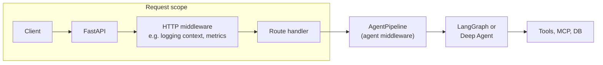
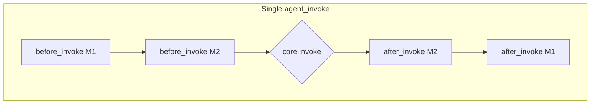

# How middleware shapes a production agent harness

An agent harness is the glue between a language model and everything else: tools, data, memory, and your app’s request/response boundary. At heart it is an LLM in a loop calling tools. Production is never just that loop. You want policies that always run, context that stays bounded, logging and metrics, and predictable behavior when something breaks.

This doc is about agent middleware in this repo: a composable layer around invocations. It sits apart from the HTTP stack and from the raw LangGraph or Deep Agents graph. The idea matches what people call “agent middleware” in LangChain-style stacks: hooks around the loop, composable ordering, and room for both framework defaults and your own code. The code lives in `src/app/core/middleware/`; examples refer to this tree, not generic tutorials.

For the wider harness story (FastAPI, auth, checkpointing, mem0, Langfuse, MCP, and the rest), see [ARTICLE.md](./ARTICLE.md).

---

## What “harness” means here

There is no single “harness” class. In this stack it is three things together:

- API and cross-request behavior: JWT, rate limits, metrics, request-scoped logging.
- Per-invocation agent behavior: graphs, tools, memory, guardrails.
- Agent middleware: a pipeline around each `agent_invoke` and, when wired up, around each model and tool step inside a graph.

The loop is still the usual one: the model proposes actions, tools run, state updates, repeat. Middleware is where you hang behavior that would otherwise get copy-pasted into every node.

---

## Why touch the harness at all?

Prompts, tool lists, and model choice are easy to vary per agent. Other needs hit every step: block or redact PII, trim or summarize context before the model runs, log tool names, bump error metrics, load and update long-term memory. If you sprinkle `if` blocks through each node, the graph gets hard to test and hard to reuse.

This project’s answer is agent middleware: a small hook surface and one pipeline per agent, with an ordered list of middleware classes.

---

## Hook names: elsewhere vs this repo

You might see `before_agent`, `before_model`, `wrap_model_call`, `wrap_tool_call`, `after_agent` in other docs. Here the contract is the abstract [`AgentMiddleware`](../src/app/core/middleware/types.py) in `src/app/core/middleware/types.py`. Same shape of idea, different method names. Rough mapping:

| Idea | In this codebase | Typical use |
|------|------------------|-------------|
| Once at start of an invocation | `before_invoke` | Load memory, validate input, short-circuit bad requests (early result, skip graph). |
| Once after the graph returns | `after_invoke` (runs in reverse registration order) | Post-process final messages, background memory update. |
| Before each LLM call | `before_model_call` | Summarize or trim message history, structured logging. |
| After each LLM response | `after_model_call` | Logging or post-processing of the model message. |
| Before each tool execution | `before_tool_call` | Observe or adjust tool arguments. |
| After each tool result | `after_tool_call` | Observe or transform tool output. |
| On exception from the graph | `on_error` | Safe empty result in production, or re-raise in dev. |
| End-to-end wrap of model or tool | No single `wrap_model_call` / `wrap_tool_call` | Pair `before_*` and `after_*`, plus call-site helpers like `model_invoke_with_metrics` and model `.with_retry()` in the chatbot. |

`before_model_call` and `after_model_call` only run if the graph node that talks to the model goes through the pipeline’s `MiddlewareManager`. The chatbot does that in `_chat_node` and `_tool_call_node` via `self._pipeline.manager` and `run_before_model_call`, `run_after_model_call`, `run_before_tool_call`, `run_after_tool_call`. That is cooperative: the pipeline and the nodes agree on the contract. Middleware is not implicit. Agents with a closed loop (for example Deep Agents from `create_deep_agent`) do not get those per-step hooks unless the framework calls them; this repo wraps the whole `ainvoke` in an outer `AgentPipeline` and can still attach LangChain `middleware` on the inner agent when needed.

Invocation state lives in [`AgentContext`](../src/app/core/middleware/types.py): `messages`, `session_id`, `user_id`, `config` (Langfuse callbacks, thread id via `build_invoke_config`), `agent_name`, and a `metadata` dict middleware can read and write (for example `long_term_memory` from `MemoryMiddleware`).

[`MiddlewareManager`](../src/app/core/middleware/pipeline.py) runs `before_*` in registration order and `after_*` in reverse order, same nesting feel as HTTP middleware stacks.

---

## `AgentPipeline` and `MiddlewareManager`

[`AgentPipeline`](../src/app/core/middleware/pipeline.py) takes a list of middleware instances and an `invoke_fn` (the core graph or agent call). `run`:

1. Sets `active_ctx` on the manager so nodes can read the current `AgentContext`.
2. Runs `run_before_invoke`; if any middleware returns non-`None`, the graph is skipped (guardrail short-circuit).
3. Calls the core function; on exception, runs `on_error` until something returns a result, or the exception bubbles out.
4. Runs `run_after_invoke` in reverse order.
5. Clears `active_ctx` in `finally`.

That gives you one place for logging, error policy, and memory without duplicating it across agents.

---

## Examples from this repo

Below is how the tree is actually used, not a third-party walkthrough.

### Business logic and compliance

Some rules should not live only in a prompt. Content policy and PII handling are deterministic and should run on every request.

- [`GuardrailMiddleware`](../src/app/core/middleware/guardrail_middleware.py): `before_invoke` (content filter, block some PII on input), `after_invoke` (redact PII on assistant output, optional async safety check). It can return early from `before_invoke` so the model never runs on disallowed input.
- The text-to-SQL agent uses the same outer pipeline for logging, errors, and guardrails, and passes LangChain `PIIMiddleware("email")` into `create_deep_agent` in `src/app/agents/text_to_sql/text_sql_agent.py`. Harness-level middleware wraps the whole invocation; framework middleware sits inside the Deep Agent loop for email.

Compliance is not something you “prompt in”; it belongs in the harness.

### Context management

Garbage in, garbage out on context. This project uses `before_model_call` to keep history inside budget:

- [`SummarizationMiddleware`](../src/app/core/middleware/summarization_middleware.py) calls `summarize_if_too_long` from `src/app/core/context/` so long history is compressed before the model runs.
- [`TrimLongMessagesMiddleware`](../src/app/core/middleware/trim_long_messages_middleware.py) uses LangChain `trim_messages` with a “last” strategy so recent messages survive when the list is too long.

The chatbot registers both in `AgentChatbot` together with memory and logging (`src/app/agents/chatbot/agent_chatbot.py`).

- [`MemoryMiddleware`](../src/app/core/middleware/memory_middleware.py): `before_invoke` runs `get_relevant_memory` and sets `ctx.metadata["long_term_memory"]`; `after_invoke` runs `bg_update_memory` from returned messages. Retrieval and write-back stay out of routing logic in the graph.

### Dynamic control (tools, model, prompt)

“Swap tools at runtime” or “pick a subset per turn” here is mostly graph structure and tool loading (MCP tools in the chatbot, for example), not a dedicated selector middleware class. You extend by adding an `AgentMiddleware` or by adding nodes and edges. Middleware stays thin for cross-cutting rules; routing stays in the graph where you can see it.

### Production behavior

Things demos skip but ops care about:

- [`ErrorHandlingMiddleware`](../src/app/core/middleware/error_handling_middleware.py): `on_error`, LLM error metrics, and in non-dev environments an empty result instead of leaking stack traces to the client.
- [`LoggingMiddleware`](../src/app/core/middleware/logging_middleware.py): invoke start/end; at debug, model and tool boundaries with `structlog` and fields like `agent_name`, `session_id`.
- LLM calls often go through `model_invoke_with_metrics` in `src/app/core/metrics/`; the chatbot wraps the model with `.with_retry()` for flaky APIs. Same operational story as middleware, but some of that lives at the call site as well as in `on_error`.

### Environment around the loop

Other writeups describe middleware that spins up a shell for the run. Here the close cousin is MCP: sessions and tools are set up outside the core loop, then used from graph nodes. See `_load_mcp_tools` and `handle_mcp_tool_call` in `src/app/agents/chatbot/agent_chatbot.py` and `src/app/core/mcp/`. That is not implemented as `before_invoke` / `after_invoke` middleware in this tree, but it answers the same need: stable resources the agent can reuse across turns.

---

## Deep Agents plus an outer pipeline

Deep Agents (via `deepagents`) ship a full loop with strong defaults. In `TextSQLDeepAgent`, `create_sql_deep_agent()` passes `create_deep_agent` a model, SQL tools, filesystem backend, skills, and LangChain `PIIMiddleware` on the inner agent. `TextSQLDeepAgent` then wraps `agent.ainvoke` in `AgentPipeline` with `LoggingMiddleware`, `ErrorHandlingMiddleware`, and `GuardrailMiddleware`.

You end up with two layers: harness policies on every `agent_invoke`, and framework middleware inside the deep agent. The custom chatbot path uses an explicit LangGraph and wires per-step model and tool hooks to `MiddlewareManager`, which is more control and more node code.

---

## Why keep this abstraction?

Models will keep improving; some of today’s context trimming may move closer to the model over time. What does not live in weights is policy: what the org allows, what you log, how you fail, and how you reuse those rules across agents. Middleware splits those concerns into small classes with a defined order and keeps prompts, tools, and graph code from turning into an infrastructure dump.

Shared behavior lives under `src/app/core/middleware/`; agents under `src/app/agents/` pick their stack when they build `AgentPipeline`. Start from `src/app/core/middleware/__init__.py` for exports and [`pipeline.py`](../src/app/core/middleware/pipeline.py) for execution order, then read the chatbot and text-to-SQL agents for the two integration styles.

---

## Further reading

- [Building a production-ready AI agent harness](./ARTICLE.md): HTTP middleware, auth, memory, observability, and the rest.
- Types and runner: [`src/app/core/middleware/types.py`](../src/app/core/middleware/types.py), [`src/app/core/middleware/pipeline.py`](../src/app/core/middleware/pipeline.py)
- Reference wiring: [`src/app/agents/chatbot/agent_chatbot.py`](../src/app/agents/chatbot/agent_chatbot.py), [`src/app/agents/text_to_sql/text_sql_agent.py`](../src/app/agents/text_to_sql/text_sql_agent.py)
